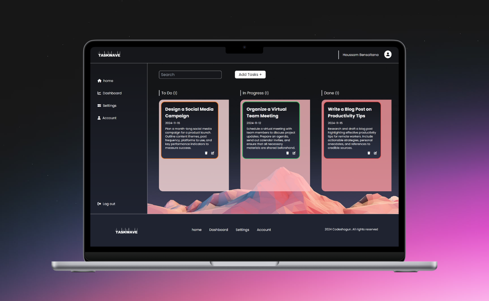

# To-Do List Application

Une application de To-Do List moderne et accessible, développée en utilisant **HTML**, **CSS**, **JavaScript** et **Tailwind CSS**. Cette application permet aux utilisateurs de gérer efficacement leurs tâches, de visualiser leur statut et leur priorité, et de suivre des statistiques détaillées.

## Fonctionnalités

1. **Interface de liste de tâches :** Une page d'accueil présentant la To-Do List, avec une structure HTML et CSS soignée. L'interface est responsive et utilise Tailwind CSS pour garantir une apparence moderne et uniforme sur tous les écrans.

2. **Modal d'ajout de tâche :** 
   - Un modal permet aux utilisateurs d'ajouter une nouvelle tâche.
   - Champs inclus :
     - **Titre**
     - **Description**
     - **Statut** (To Do, Doing, Done)
     - **Date d'échéance**
     - **Priorité** (P1, P2, P3)
   - La couleur et le style de chaque tâche sont automatiquement ajustés en fonction de la priorité sélectionnée.

3. **Changement de statut :** Les utilisateurs peuvent facilement changer le statut de chaque tâche entre les options *To Do*, *Doing* et *Done*.

4. **Accessibilité :** Conçu pour être accessible, l'application respecte les critères de contraste de couleurs et inclut des labels pour les éléments de formulaire, facilitant l'usage pour les personnes ayant des besoins spécifiques.

5. **Suppression de tâches :** Possibilité de supprimer des tâches existantes pour une gestion plus flexible et fonctionnelle.

6. **Validation des formulaires :** Vérification de l'intégrité des informations saisies pour garantir la qualité des données.

7. **Statistiques des tâches :** Visualisation des statistiques incluant le nombre de tâches en fonction de leur statut (To Do, Doing, Done) et de leur priorité.

---

